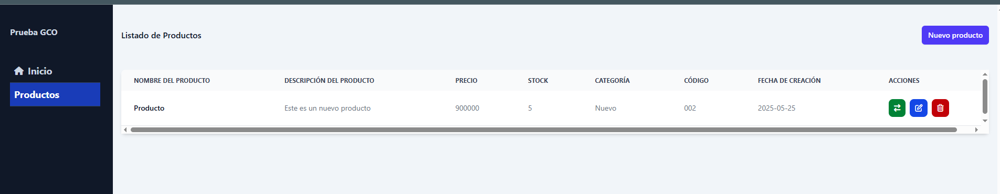
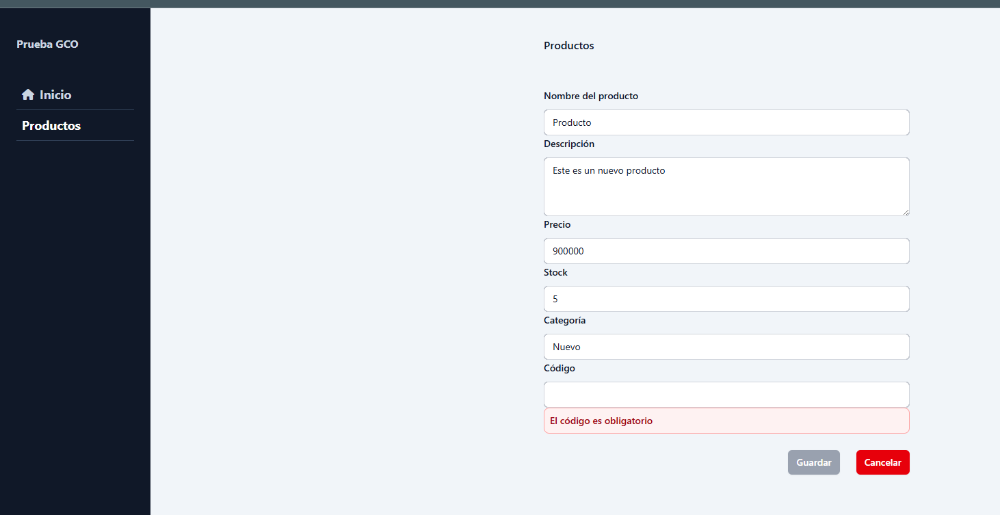
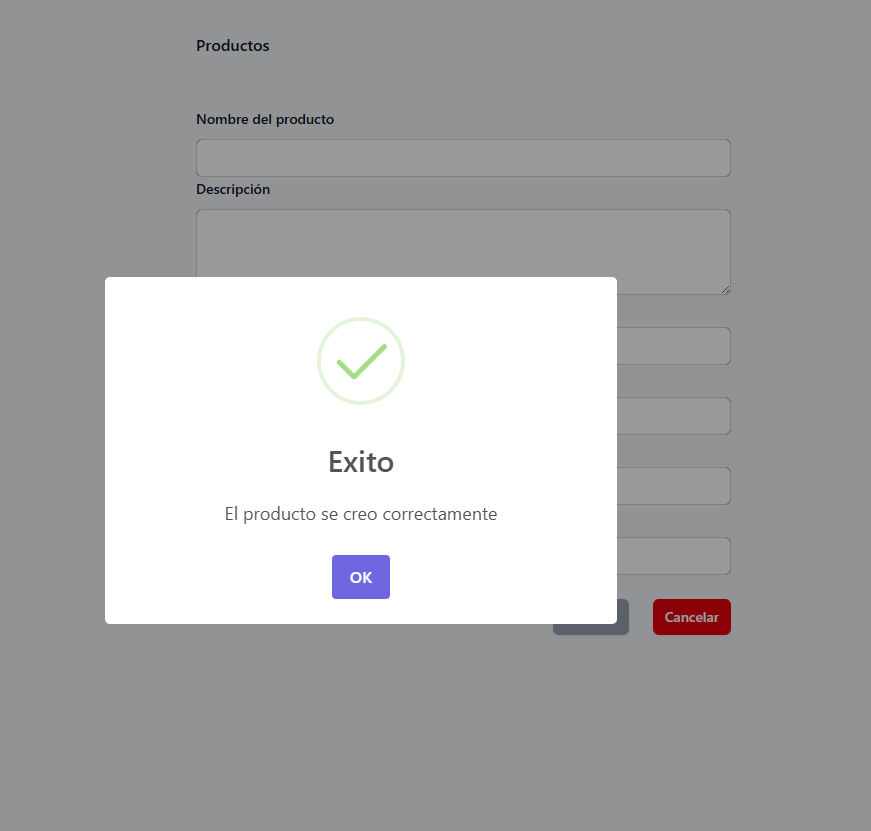
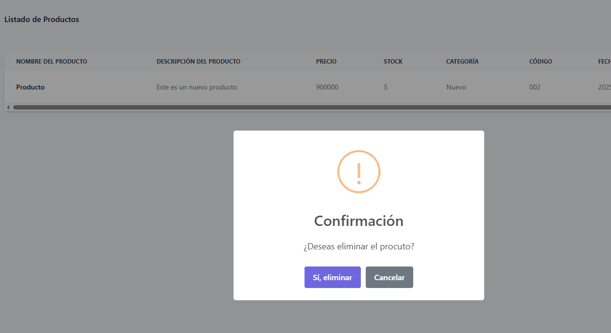
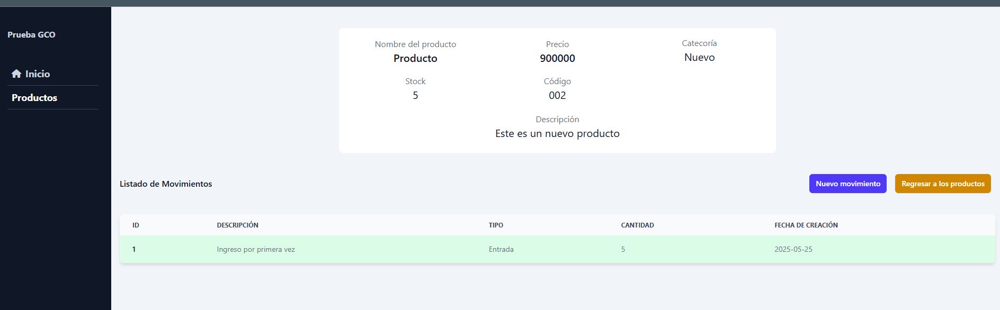
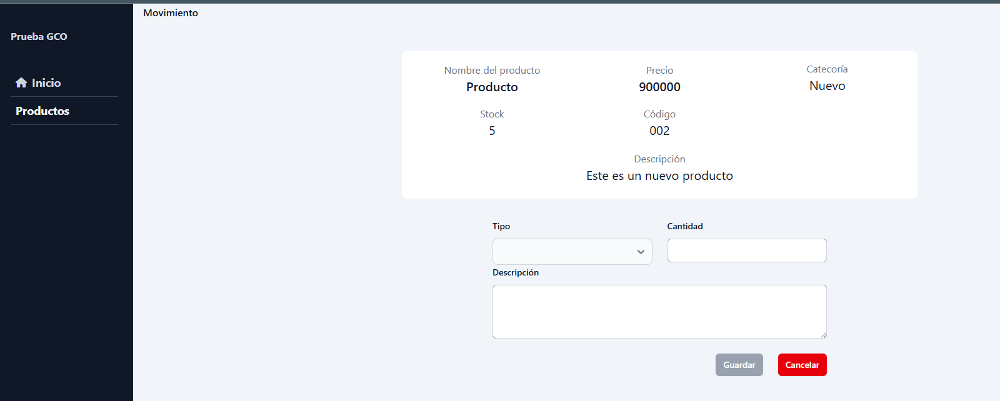

# FrontGCO

El siguiente proyecto es una implementación del modulo de producto con movimientos.

Este proyecto se generó utilizando [Angular CLI](https://github.com/angular/angular-cli) version 19.2.12.


##  Características
-  Gestión de productos (CRUD completo)
-  Sistema de navegación
-  Interfaces compartidas
-  Servicios modulares
-  Formularios reactivos con validación
-  Responsive design

##  Tecnologías Utilizadas
- **Frontend**: Angular 19.2.12.
- **Styling**: CSS3 /  Tailwind
- **Forms**: Angular Reactive Forms
- **HTTP Client**: Angular HttpClient
- **Routing**: Angular Router
- **Icons**: Font Awesome 
- **Development**: TypeScript

## 📁 Estructura del Proyecto
```bash
src/
├── app/
│   ├── Controllers/          # Controladores principales
│   ├── pages/               # Páginas de la aplicación
│   │   └── home/           # Página de inicio
│   ├── movements/          # Módulo de movimientos
│   │   ├── interfaces/     # Interfaces de movimientos
│   │   ├── pages/         # Páginas de movimientos
│   │   └── services/      # Servicios de movimientos
│   ├── product/           # Módulo de productos
│   │   ├── interfaces/    # Interfaces de productos
│   │   ├── pages/        # Páginas de productos
│   │   └── services/     # Servicios de productos
│   ├── shared/           # Componentes compartidos
│       └── navMenu/      # Navegación principal
├── public/               # Archivos públicos
|   └── imagenes/        #Archivos de imagenes
```

## Modulos 

### Listado de Productos


### Creación de Producto


### Notificación de guardado


### Validación para eliminar 


### Listado de movimiento


### Crear movimiento
